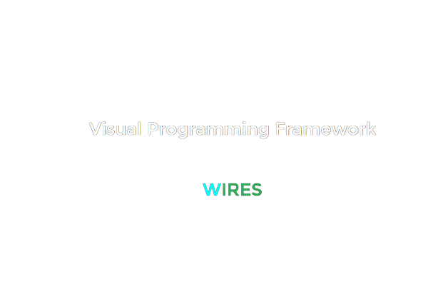

## Visual Programming Framework

Wires helps you implement text-based programming languages visually
It'll handle abstraction so you can just focus on what's needed

---

### Running the code locally

##### Requirements
 - NodeJS Installed on your system

In project root, run the following command after first time cloning the project to install all required packages

```sh
npm i
```

Now to start the dev server, run

```sh
npm run dev
```

It'll show you the server address (which is usually http://localhost:5173/), open it in your browser and you are good to go

---

### Project structure (For contributors)

- /src
    - /api
        - includes all the files that contribute to the main fuctionality of the framework
    - /interfaces
        - contains type files
    - /internal
        - mainly internal_nodes.ts which includes all the default nodes
    - /styles
        - yes as you might've inferred, included css styling files, (it's planned to completely remove css style files, and rather create a global theming feature which every wire node extends from)
    - /transpiler
        - WILL included the compiler for wires
    - main.ts
        - entry point file of the framework

---

### How to create your own custom nodes?

In wires, every node extends from the base WireNode class
For example, below is the example implementation of default VariableNode class

```ts
export class VariableNode extends WireNode {
    controller!: NodeFieldController;

    static doc(): NodeData {
        return {
            name: "Variable Node",
            documentation: "This node is used to store data",
        };
    }
    build(): Widget {
        return new NodeScaffold({
            header: new NodeHeader({
                title: "Variable Node",
            }),
            body: new NodeBody({
                children: [
                    new NodeField({
                        value: 0,
                        label: "x",
                        fieldType : "both",
                        controller: (fieldController) => {
                            this.controller = fieldController;
                        },
                    }),
                ],
            }),
        });
    }

    @bind
    out(): WireOutData {
        return {
            data: this.controller.value,
        };
    }
}

```

Every Node must/should have a
- build method, which returns a widget tree (refer to /src/api/widgets.ts)
- A static doc method which returns the NodeData, required for documentation of the features this node provides in node explorer at runtime
- and an optional out() function which returns output of this node

The node field widget has a callback controller function which accepts a NodeFieldController argument, which will be called when an input field is created at runtime, you can use this controller to later get/set the value of the input like I've returned the input's value in the out function of the variable node

---

### Lifecycles

- #### Widget Lifecycle
    - buid() - main
    - postBuild()
- #### Node Lifecycle
    - prebuild()
    - build() - main
    - postBuild()
    - rebuild() - forces node to recreate itself during runtime
    - destroy() - called before a node is removed from global tree
